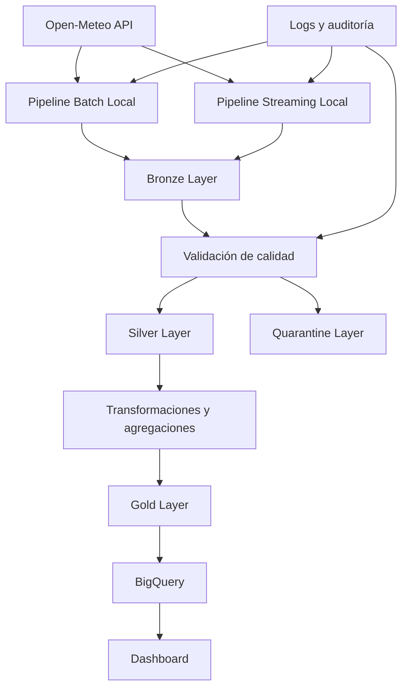

# Diagrama inicial de arquitectura

Este diagrama representa la arquitectura conceptual inicial del proyecto **Smart City Climate Platform**. En esta primera fase todavía no se implementan todos los componentes, pero se define el flujo esperado de datos desde la fuente original hasta las capas analíticas.



## Explicación del diagrama

La arquitectura comienza con **Open-Meteo API**, que será la fuente principal de datos meteorológicos. Desde esta API se obtendrán datos históricos mediante un proceso Batch y, más adelante, datos actuales mediante un flujo Streaming.

El **Pipeline Batch Local** se encargará de consultar información histórica, procesarla y almacenarla en las capas del proyecto. Esta será la primera implementación funcional, ya que permite construir la base del sistema sin depender todavía de servicios en la nube.

El **Pipeline Streaming Local** simulará la captura periódica de datos actuales. En una fase posterior, este flujo será migrado a servicios como Pub/Sub, Cloud Run o Cloud Functions.

La **Bronze Layer** almacenará los datos originales, tal como llegan desde la fuente. Esta capa es importante porque permite conservar una copia fiel del dato recibido antes de aplicar transformaciones.

La etapa de **Validación de calidad** revisará aspectos como valores nulos, duplicados, tipos de datos incorrectos y rangos inválidos. Los registros válidos avanzarán hacia la capa Silver, mientras que los registros problemáticos se enviarán a la **Quarantine Layer**.

La **Silver Layer** contendrá datos limpios, estandarizados y preparados para análisis o agregaciones posteriores.

Desde Silver se generarán transformaciones y métricas agregadas, que serán almacenadas en la **Gold Layer**. Esta capa tendrá datos listos para consumo analítico.

En fases posteriores, la información de Gold será cargada en **BigQuery**, desde donde se conectará un **dashboard** para visualizar métricas climáticas, estado actual, comportamiento histórico y calidad del dato.

Finalmente, los componentes de **logs y auditoría** permitirán registrar ejecuciones, errores, métricas operacionales y estados del pipeline.

```
```
